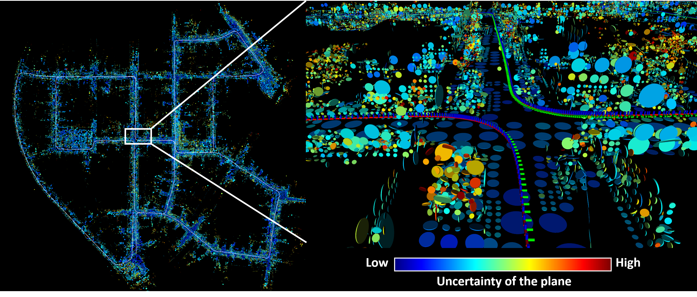
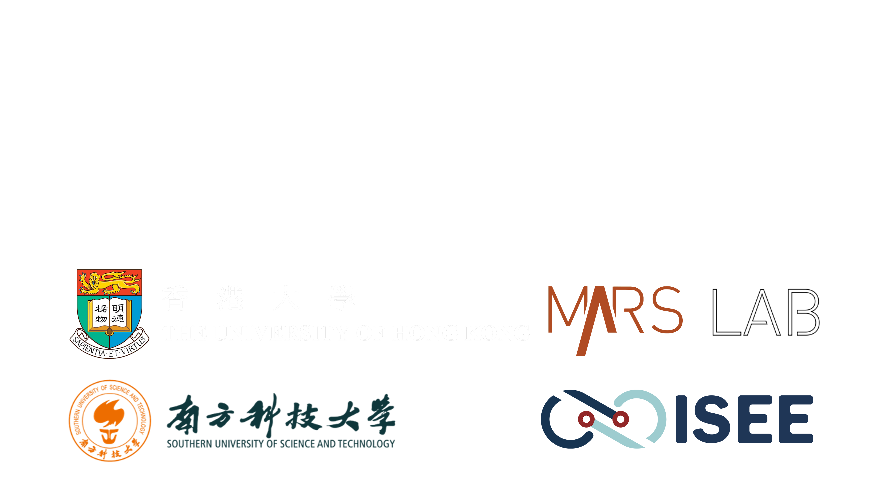

# VoxelMap

## Introduction
**VoxelMap** is an efficient and probabilistic adaptive(coarse-to-fine) voxel mapping method for 3D LiDAR. Unlike the point cloud map, VoxelMap uses planes as representation units. A scan of LiDAR data will generate or update the plane. Each plane contains its own plane parameters and uncertainties that need to be estimated. This repo shows how to integrate VoxelMap into a LiDAR odometry.

<div align="center">
    
    <font color=#a0a0a0 size=2>The plane map constructed by VoxelMap on KITTI Odometry sequence 00.</font>
</div>

### Developers:
[Chongjian Yuan 袁崇健](https://github.com/ChongjianYUAN)， [Wei Xu 徐威](https://github.com/XW-HKU)


### Related paper
Related paper available on **arxiv**:  
[Efficient and Probabilistic Adaptive Voxel Mapping for Accurate Online LiDAR Odometry](https://arxiv.org/abs/2109.07082)

### Related video
Our accompanying videos are now available on **YouTube**.
<div align="center">
    <a href="https://youtu.be/HSwQdXg31WM" target="_blank">
    
</div>


## 1. Prerequisites
### 1.1. **PCL && Eigen**

PCL>= 1.8,   Follow [PCL Installation](http://www.pointclouds.org/downloads/linux.html).

Eigen>= 3.3.4, Follow [Eigen Installation](http://eigen.tuxfamily.org/index.php?title=Main_Page).

### 1.2. **livox_ros_driver**
Follow [livox_ros_driver Installation](https://github.com/Livox-SDK/livox_ros_driver).

## 2. Build
Clone the repository and catkin_make:
```
    cd ~/$A_ROS_DIR$/src
    git clone https://github.com/hku-mars/VoxelMap.git
    cd ..
    catkin_make
    source devel/setup.bash
```
- Remember to source the livox_ros_driver before build (follow 1.2 **livox_ros_driver**)

## 3. Run on Dataset
Current version of VoxelMap does not support IMU and requires **undistorted** point cloud.
### 3.1 Run on KITTI Odometry dataset
Step A: Setup before run
Edit ``` config/velodyne.yaml ``` to set the below parameters:
1. LiDAR point cloud topic name: ``` lid_topic ```
2. If you want to show the voxel map, set ```pub_voxel_map``` to ```true```
3. If you want to show the accumulated point cloud map, set ```pub_point_cloud``` to ```true```

Step B: Run below
```
    cd ~/$VOXEL_MAP_ROS_DIR$
    source devel/setup.bash
    roslaunch voxel_map mapping_velodyne.launch
```

Step C: Play rosbag.

If want to save the trajectory result (camera pose), set the ```write_kitti_log``` to ```true``` and change the ```result_path``` to your own path.

### 3.2 Run on L515 dataset
Step A: Download our bags here: [Voxel Map L515 Datasets](https://connecthkuhk-my.sharepoint.com/:f:/g/personal/ycj1_connect_hku_hk/EgILu82us_ZHhYERmckDbIkBRwsWuVANMunOePjHtSOqTg?e=iW3izS)

Then the same step as **3.1**

## 4.Acknowledgments
Thanks for [Fast-LIO2](https://github.com/hku-mars/FAST_LIO) (Fast Direct LiDAR-inertial Odometry)

## 5. License

The source code is released under [GPLv2](http://www.gnu.org/licenses/) license.For any technical issues, please contact us via email [ycj1@connect.hku.hk](mailto:ycj1@connect.hku.hk). For commercial use, please contact Dr. Fu Zhang [fuzhang@hku.hk](mailto:fuzhang@hku.hk).
